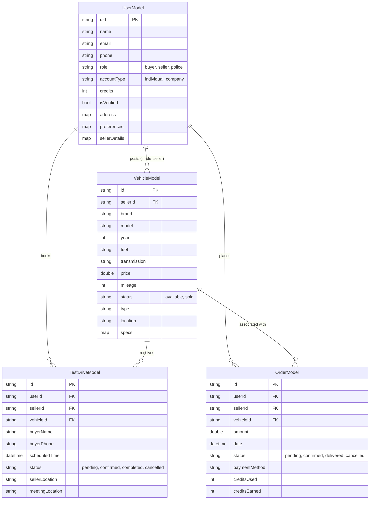

# Carvia System Architecture

## Entity Reference (ER) Diagram
This diagram outlines the primary NoSQL data structures mapped within Cloud Firestore. Although Firestore is schema-less, the app enforces these relational structures through data models.

## Application Architecture

Carvia utilizes a **Clean Architecture** approach combined seamlessly with **Provider** for state management. This ensures maximum separation of concerns.

### Presentation Layer
- **UI Widgets:** Standard Flutter components (e.g., `ComparePage`, `HomeView`).
- **State Holders:** Providers that manage logical state bindings connecting pure UI to business processes.

### Domain Layer
- **Models:** Strongly typed Dart classes directly representing Core Entities (`VehicleModel.dart`, `UserModel.dart`). 
- **Business Logic Services:** Handlers like `CompareService.dart` taking atomic user intents and processing pure logic (e.g., maximum cap rules).

### Data Layer
- **Repositories & Apis:** Classes dedicated to abstracting away `cloud_firestore` logic (e.g., `VehicleService.dart`).
- **External Dependencies:** Firebase Auth, Firebase Storage, and Google Generative AI (Gemini).
